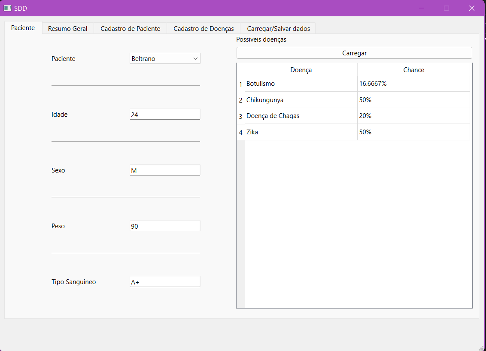
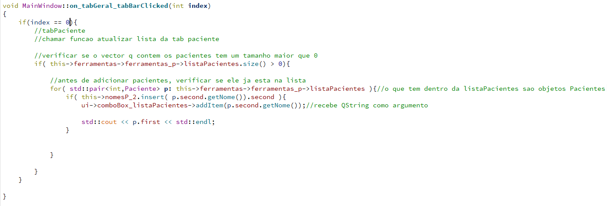

# Projeto_TP_EE2022_SDD
###Sistema de Dedução de Doenças

##Proposta
Relacionar um paciente com uma doença com base em sintomas em comum.

##Interface
*###Paciente
*###Resumo Geral
*###Cadastro de Paciente
*###Cadastro de doenças
*###Carregar/Salvar dados

###Paciente

*O combobox é preenchido quando a aba "Paciente" é selecionada.

*A tablewidget é atualizada sempre que o botao "Carregar" é pressionado.

###Resumo Geral

###Cadastro de Paciente

###Cadastro de doenças

###Carregar/Salvar dados
