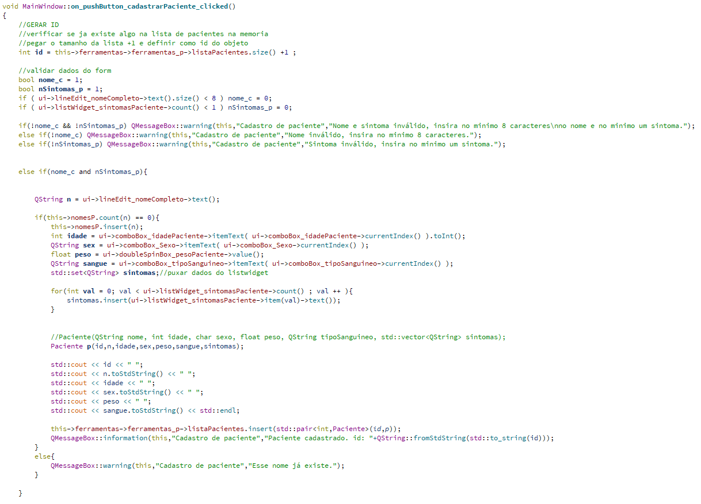

# Projeto_TP_EE2022_SDD
### Sistema de Dedução de Doenças

## Proposta
Relacionar um paciente com uma doença com base em sintomas em comum.

## Interface
* ### Paciente
* ### Resumo Geral
* ### Cadastro de Paciente
* ### Cadastro de doenças
* ### Carregar/Salvar dados

### Paciente

* O combobox é preenchido quando a aba "Paciente" é selecionada.

* A tablewidget é atualizada sempre que o botao "Carregar" é pressionado.

### Resumo Geral

<<<<<<< HEAD
* A tabela é atualizanda quando o botão "Atualizar" é pressionado

### Cadastro de Paciente

* Um objeto é criado quando o botão "Cadastrar" é pressionado, os dados se aplicam ao contructor da classe Paciente

* Classe Paciente

* Algoritmo para adicionar e remover objetos das listwidgets

### Cadastro de doenças

* Um objeto é criado quando o botão "Salvar" é pressionado, os dados se aplicam ao contructor da classe Doenca

* Algoritmo para adicionar sintomas ao listwidget e excluir sintomas

* Classe Doenca

### Carregar/Salvar dados

* Salva os dados em CSV, e permite carregar os dados ao inciar o programa

* Algoritmo para carregar dados da doenca

        void FerramentasD::carregarListaCSVDoencas(){

            int id;
            QString nomeDoenca;
            QString causador;
            //std::set<QString> sintomas;
            std::string temp;

            std::ifstream dadosDoencasCsv("dados\\Doencas\\Doencas.csv");
            if(dadosDoencasCsv.is_open()){
                while ( std::getline(dadosDoencasCsv, temp, ',') ) {
                    id = stoi(temp);

                    std::getline(dadosDoencasCsv, temp, ',');
                    nomeDoenca = QString::fromStdString(temp);

                    std::getline(dadosDoencasCsv, temp);
                    causador = QString::fromStdString(temp);

                    //gerar lista de sintomas
                    this->carregarListaSintomasDoenca(id);

                    //gerar objeto
                    Doenca d(id,nomeDoenca,causador,this->sintomasD);

                    this->listaDoencas[id] = d;
                    this->sintomasD.clear();

                }
                dadosDoencasCsv.close();
            }

        }
        void FerramentasD::carregarListaSintomasDoenca(int id){
        //    std::cout << " sintomas \n";
            std::string sintoma;
            std::ifstream dadosDoencasSintomasCsv("dados\\Doencas\\Sintomas\\"+std::to_string(id)+".csv");
            if(dadosDoencasSintomasCsv.is_open() ){
                while (std::getline(dadosDoencasSintomasCsv,sintoma) ) {
                    this->sintomasD.insert(QString::fromStdString(sintoma));
                    this->sintomasD_compartilhavel.insert(QString::fromStdString(sintoma));
                }
                dadosDoencasSintomasCsv.close();
            }
        }

* Algoritmo para carregar dados do Paciente

                void FerramentasP::carregarListaCSVPacientes(){
                    int idPaciente;
                    std::string temp;
                    QString nomePaciente;
                    int idade;
                    QString sexo;
                    float peso;
                    QString tipoS;
                    //std::set<QString> sintomas;//guardando copias?

                    std::ifstream dadosPacientesCsv("dados\\Pacientes\\Pacientes.csv");
                    if(dadosPacientesCsv.is_open()){

                //        std::cout << "OK \n";
                        while(std::getline(dadosPacientesCsv,temp,',')){
                            idPaciente = std::stoi(temp);
                //            std::cout << temp << ", ";
                //            std::getchar();

                            std::getline(dadosPacientesCsv,temp,',');
                            nomePaciente = QString::fromStdString(temp);
                //            std::cout << temp << ", ";
                //            std::getchar();

                            std::getline(dadosPacientesCsv,temp,',');
                            idade = std::stoi(temp);
                //            std::cout << temp << ", ";
                //            std::getchar();

                            std::getline(dadosPacientesCsv,temp,',');
                            sexo = QString::fromStdString(temp);
                //            std::cout << temp << ", ";
                //            std::getchar();

                            std::getline(dadosPacientesCsv,temp,',');
                            peso = std::stof(temp);
                //            std::cout << temp << ", ";
                //            std::getchar();

                            std::getline(dadosPacientesCsv,temp);
                            tipoS = QString::fromStdString(temp);
                //            std::cout << temp << std::endl;

                //            std::cout << " carregando lista de sintomas \n";
                            //carregar lista de sintomas para o paciente
                            this->carregarListaSintomasPaciente(idPaciente);

                //            std::cout << " gerando objeto paciente \n";
                            //criar objeto paciente
                            Paciente p(idPaciente,nomePaciente,idade,sexo,peso,tipoS,this->sintomasP);
                            //adicionar seu endereço ao map
                            this->listaPacientes[idPaciente] = p;
                            this->sintomasP.clear();

                        }
                        dadosPacientesCsv.close();
                    }

                }
                void FerramentasP::carregarListaSintomasPaciente(int id){
                //    std::cout << " sintomas \n";
                    std::string sintoma;
                    std::ifstream dadosPacientesSintomasCsv("dados\\Pacientes\\Sintomas\\"+std::to_string(id)+".csv");
                    if(dadosPacientesSintomasCsv.is_open() ){
                        while (std::getline(dadosPacientesSintomasCsv,sintoma) ) {
                            this->sintomasP.insert(QString::fromStdString(sintoma));
                        }
                        dadosPacientesSintomasCsv.close();
                    }

                }

        * Algoritmo para salvar dados de paciente ou doença

        bool Ferramentas::salvarCSV(bool m){
            //se m = 1 -> salvar pacientes
            //se m = 0 -> salvar doencas

            //Não pode adicionar pacientes existentes

            if(m){
            //paciente
                QString nome;
                int idade;
                QString sexo;
                float peso;
                QString tipoSanguineo;
                std::set<QString> sintomas;
                int idPaciente;
                int linhas = 0;
                std::string temp;
                std::set<QString> listaTemporaria;
                bool aconteceuAlgo = 0;

                //abrir a lista de pacientes csv
                std::ifstream dadosCarregados("dados\\Pacientes\\Pacientes.csv");

                if( dadosCarregados.is_open() ){

                    //contar numero de linhas
                    //pegar cada nome e adicionar a um set
                    while(std::getline(dadosCarregados,temp,',')) {
                        std::getline(dadosCarregados,temp, ',');
                        listaTemporaria.insert(QString::fromStdString(temp) );
                        linhas ++;
                        std::getline(dadosCarregados,temp);
                        std::cout<< "Salvar dados: lendo lista de pacientes, linha atual: "<< linhas << " string " << temp;

                    }
                    dadosCarregados.close();
                }

                std::ofstream dadosCSVSalvar("dados\\Pacientes\\Pacientes.csv",std::ios::app);//se o arquivo nao existir, ele vai criar

                if( dadosCSVSalvar.is_open() ){

                //para cada objeto da lista de pacientes na memoria, adicionar ao set, e verificar o .second
                //se falso, nada acontece
                //se verdadeiro, adcione ao arquivo CSV
                    if( this->ferramentas_p->listaPacientes.size() > 0 ){

                        for( std::pair<int,Paciente> paciente : this->ferramentas_p->listaPacientes  ){

                            nome = paciente.second.getNome();
                            if( listaTemporaria.insert( nome ).second ){
                                aconteceuAlgo = 1;
                                idade = paciente.second.getIdade();
                                sexo = paciente.second.getSexo();
                                peso = paciente.second.getPeso();
                                tipoSanguineo = paciente.second.getTipoSanguineo();
                                sintomas = paciente.second.getSintomas();

                                //idPaciente = paciente.second.getIdPaciente();//substituir por linhas
                                idPaciente = linhas + 1;
                                std::cout <<  std::endl << "idPaciente: " << idPaciente << std::endl;

                                dadosCSVSalvar << idPaciente << "," << nome.toStdString() << "," << idade << ",";
                                dadosCSVSalvar << sexo.toStdString() << "," << peso << "," << tipoSanguineo.toStdString() << "\n";

                                //criar lista csv de sintomas relacionado ao id do paciente
                                std::ofstream sintomasCSV("dados\\Pacientes\\Sintomas\\" +std::to_string( idPaciente ) +".csv");
                                if( sintomasCSV.is_open() ){
                                    for( QString s: sintomas ){
                                        sintomasCSV << s.toStdString() << std::endl;
                                    }
                                    sintomasCSV.close();
                                }

                            }

                        }

                        dadosCSVSalvar.close();
                        if(aconteceuAlgo == 0 ) return 0;
                        return 1;
                    }else{
                        //exibir warning
                        return 0;
                    }

                }

            }else{
                //doenca
                int id;
                QString nomeDoenca;
                QString causador;
                std::set<QString> listaTemporaria;
                std::set<QString> sintomas;
                std::string temp;
                int linhas = 0;
                bool aconteceuAlgo = 0;

                //abrir a lista de pacientes csv
                std::ifstream dadosCarregados("dados\\Doencas\\Doencas.csv");

                if( dadosCarregados.is_open() ){

                    //contar numero de linhas
                    //pegar cada nome e adicionar a um set
                    while(std::getline(dadosCarregados,temp,',')) {
                        std::getline(dadosCarregados,temp, ',');
                        listaTemporaria.insert(QString::fromStdString(temp) );
                        linhas ++;
                        std::getline(dadosCarregados,temp);

                    }
                    dadosCarregados.close();
                }

                std::ofstream dadosCSVSalvar("dados\\Doencas\\Doencas.csv",std::ios::app);

                if( dadosCSVSalvar.is_open() ){

                    if( this->ferramentas_d->listaDoencas.size() > 0 ){

                        for( std::pair<int,Doenca> doenca : this->ferramentas_d->listaDoencas){
                            nomeDoenca = doenca.second.getNomeDoenca();

                            if( listaTemporaria.insert( nomeDoenca ).second ){
                                aconteceuAlgo = 1;
                                id = linhas + 1;
                                causador = doenca.second.getCausador();
                                sintomas = doenca.second.getSintomas();

                                dadosCSVSalvar << id << "," << nomeDoenca.toStdString() << "," << causador.toStdString() << "\n";

                                //criar lista csv de sintomas relacionado ao id do paciente
                                std::ofstream sintomasCSV("dados\\Doencas\\Sintomas\\" +std::to_string( id ) +".csv");
                                if( sintomasCSV.is_open() ){
                                    for( QString s: sintomas ){
                                        sintomasCSV << s.toStdString() << std::endl;
                                    }
                                    sintomasCSV.close();
                                }

                            }

                        }

                    }
                    dadosCSVSalvar.close();
                    if(aconteceuAlgo == 0 ) return 0;
                    return 1;
                }else{
                    return 0;
                }

            }
        }

* Constructor do mainwindow que carrega verifica o arquivo de configurancao incial
* esse arquivo diz se os dados devem ser carregados ao iniciar
* no contructor tambem tem um algoritmo que preenche dados da combo de idade

        MainWindow::MainWindow(QWidget *parent)
            : QMainWindow(parent)
            , ui(new Ui::MainWindow)
        {
            ui->setupUi(this);
            std::ifstream inicializarConfig("config_inicializar.txt");
            if( inicializarConfig.is_open() ){
                std::string temp;
                bool inicializarP = 0;
                bool inicializarD = 0;
                std::getline(inicializarConfig,temp,' ');
                inicializarConfig >> inicializarP;
                std::getline(inicializarConfig,temp,' ');
                inicializarConfig >> inicializarD;
                std::cout << inicializarP << " " << inicializarD << std::endl;
                ui->checkBox_carregarPacientesIniciar->setChecked(inicializarP);
                ui->checkBox_carregarDoencasIniciar->setChecked(inicializarD);
                inicializarConfig.close();
            }else{
                QMessageBox::warning(this,"Inicializar","Não foi possivel encontrar o arquivo\nde inicialização");
            }
            //Este FOR adiciona valores ao comboBox que guarda as idades aceitaveis
            for(int i = 1; i <= 100; i++){
                ui->comboBox_idadePaciente->addItem(QString::number(i));//a função addItem aceita apenas QChar ou QString como argumento
                                                                        //entao "QString::number(i)" converte o inteiro em objeto QString
                                                                        //nome da funcao é number, namespace QString
            }

            //automaticamente define data de cadastro para a data atual
            ui->dateEdit_dataCadastro->minimumDate() = QDate::currentDate();
            ui->dateEdit_dataCadastro->setDate(QDate::currentDate());
            //carregar lista de sintomas cadastrados

            if(ui->checkBox_carregarDoencasIniciar->isChecked()){
                this->ferramentas->ferramentas_d->carregarListaCSVDoencas();
                for( QString s : this->ferramentas->ferramentas_d->sintomasD_compartilhavel ){
                    std::cout << s.toStdString() << std::endl;
                    ui->listWidget_sintomasPossiveis->addItem(s);

                }
            }

            //verificar presença de um arquivo CSV contendo a lista de pacientes, se existir, carregar a lista map com os objetos
            //pasta pacientes que contera a lista de pacientes, dentro da pasta, outra pasta com nome sintomas, contera arquivos CSV
            //nomeadas com o nome do paciente, e contera os sintomas relacionados
            //QString nome, int idade, char sexo, float peso, QString tipoSanguineo, std::vector<QString> sintomas

            //########
            if(ui->checkBox_carregarPacientesIniciar->isChecked()){
                this->ferramentas->ferramentas_p->carregarListaCSVPacientes();

        //        std::cout << "OK \n";
            }
            //########

        }

# Algoritmo que correlaciona objetos Paciente e Doenças por meio dos sintomas

        void Ferramentas::correlacionar(int id){
            std::cout << "Correlacionar\n";
            Paciente paciente = this->ferramentas_p->listaPacientes[id];
            float ptemp = 0;

            std::cout << paciente.getNome().toStdString() << " ";
            for( QString doe : paciente.getSintomas() ){
                std::cout << doe.toStdString() << " ";
            }
            std::cout << std::endl;

            for( std::pair<int, Doenca> d : this->ferramentas_d->listaDoencas ){

                Doenca doenca = d.second;
                std::map < QString, float> mapDoenca;
                float total = 0;
                int numero_sintomas = doenca.getSintomas().size();
        //        std::cout << "tamanho da lista de sintomas da doenca " << doenca.getNomeDoenca().toStdString() << " é " << numero_sintomas << "\n";
                float percentual;

                for( QString sintoma : paciente.getSintomas() ){
                    //std::cout << sintoma.toStdString() << " " << doenca.getSintomas().count( sintoma ) << std::endl;
                    if( doenca.getSintomas().count( sintoma ) ){
                        std::cout << "tem " << sintoma.toStdString() << " " << doenca.getNomeDoenca().toStdString() << "\n";
                        total ++;
                    }

                }
                percentual = (total/numero_sintomas) * 100.0;
        //        std::cout << paciente.getNome().toStdString() << " " << doenca.getNomeDoenca().toStdString() << " " << percentual << std::endl;
        //        mapDoenca[doenca.getNomeDoenca()] = percentual;
                this->pacienteXdoencas[paciente.getNome()][doenca.getNomeDoenca()]=percentual;
                if(percentual > ptemp){
                    this->listaParaResumoGeral[paciente.getNome()] = doenca.getNomeDoenca();
                    ptemp = percentual;
                }

        //        for( std::pair<QString, std::map<QString, float> > pp : this->pacienteXdoencas ){

        //            std::cout << "NOME: " << pp.first.toStdString() << " \n ";

        //            for( std::pair<QString, float> dd : pp.second){
        //                std::cout << "NOME doenca:" <<  dd.first.toStdString() << ",- percentual " << dd.second << " \n";
        //            }

        //        }

            }
            ptemp = 0;

        }
=======
### Cadastro de Paciente

### Cadastro de doenças

### Carregar/Salvar dados

>>>>>>> e0bdb52f286f8ece9ada2eb32187085c0642b4c6
